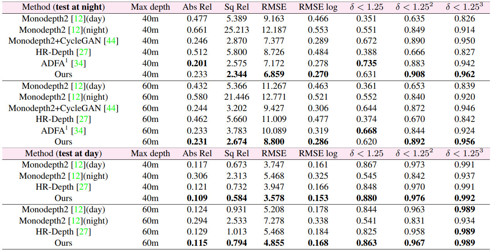

# ADDS-DepthNet

## Contents

  - [Introduction](#introduction)
  - [Data](#data)
  - [ADDS_Paddle](#adds_paddle)
  - [ADDS_Pytorch](#adds_pytorch)
  - [Citation](#citation)


## Introduction

This is the official implementation of the paper:  

> **Self-supervised Monocular Depth Estimation for All Day Images using Domain Separation**
>
> Lina Liu, Xibin Song, Mengmeng Wang, Yong Liu, Liangjun Zhang
>
> [ICCV2021](https://openaccess.thecvf.com/content/ICCV2021/papers/Liu_Self-Supervised_Monocular_Depth_Estimation_for_All_Day_Images_Using_Domain_ICCV_2021_paper.pdf)

We provide two implementations here, containing PaddlePaddle and Pytorch.

## Quantitative Result



## Data

For data download and preparation of Oxford RobotCar dataset, please refer to [Oxford RobotCar dataset data preparation](https://github.com/PaddlePaddle/PaddleVideo/blob/develop/docs/en/dataset/Oxford_RobotCar.md)

## ADDS_Paddle

For PaddlePaddle implementation, please refer to [PaddleVideo implementation of ADDS](https://github.com/PaddlePaddle/PaddleVideo/blob/develop/docs/en/model_zoo/estimation/adds.md)

## ADDS_Pytorch


### - Environment Setup

Assuming a fresh [Anaconda](https://www.anaconda.com/download/) distribution. We recommend to create a virtual environment with Python 3.6.6 `conda create -n ADDSDepthNet python=3.6.6 `. You can install the dependencies with:

```
conda install pytorch==1.4.0 torchvision==0.5.0 cudatoolkit=10.1 -c pytorch
pip install opencv-python
pip install tensorboardX==1.4
pip install ipython
pip install scikit-image
```


### - Pretrained model
 You can download the pretrained model [here](https://drive.google.com/drive/folders/14rFn5lrr6awpyPZEhbO-x5mpauXMV2n1?usp=sharing). Then put the pretrained model in "Pretrained_model".


### - Prediction for a single image

You can predict depth for a single image with:
```shell
python test_simple.py --image_path path_to_the_single_image --model_name path_to_the_pretrained_model
```


### - Training

```shell
python train.py --batch_size batch_size --data_path path_to_the_training_data
```


### - Evaluation

```
bash run_evaluation.sh
```


## Citation
If you find our work useful in your research, please cite our paper:

```
@inproceedings{liu2021self,
  title={Self-supervised Monocular Depth Estimation for All Day Images using Domain Separation},
  author={Liu, Lina and Song, Xibin and Wang, Mengmeng and Liu, Yong and Zhang, Liangjun},
  booktitle={Proceedings of the IEEE/CVF International Conference on Computer Vision},
  pages={12737--12746},
  year={2021}
}
```

## Acknowledgements

Our code is based on [Monodepth2](https://github.com/nianticlabs/monodepth2)


